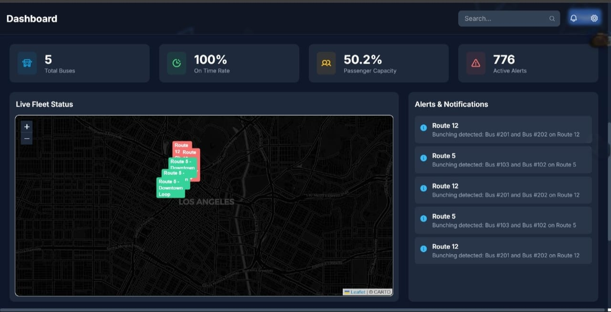
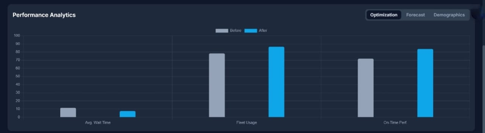
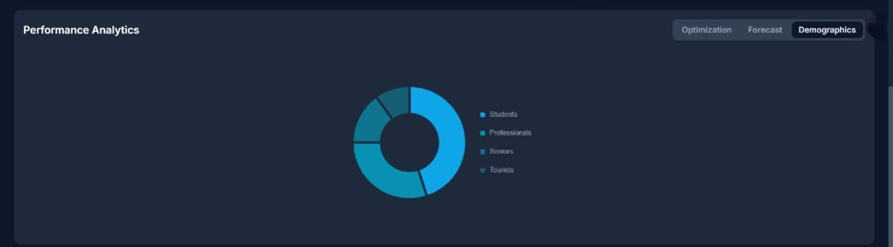

# 📊 BUSIQ Transit Dashboard

**A real-time public transit monitoring and optimization dashboard**

<p align="center">
  
</p>

---

## 🏆 Hackathon & Team

**Hackathon project** — proudly built by **The Dev Force**.

**Team ID:** `The Dev Force`

Include your hackathon name, submission link, or mentor details here if you want them printed on the README or prize submission PDF.

---

## 🏅 Badges

  
  
  
  
  


---
## 📊 Performance AnaLytics

**Optimization**
<p align="center">
  
</p>

**Forecast**
<p align="center">
  
</p>

**Demographics**
<p align="center">
  
</p>

---
## 📖 Introduction

**BUSIQ** is a web-based dashboard built to revolutionize public transit management. It enables operators to:

- 🚍 **Track buses in real-time**
- ⚠️ **Detect operational issues like bus bunching**
- 📲 **Respond instantly with actionable alerts**

With **data-driven insights, live monitoring, and AI-powered optimization**, BUSIQ reduces delays, optimizes routes, and improves the passenger experience.

---

## ✨ Features

- 🚍 **Real-time Bus Tracking** – Live bus locations & occupancy on an interactive map.
- 📊 **Live Metrics** – KPIs: on-time performance, total buses, avg. occupancy.
- ⚠️ **Smart Alerts** – Instant notifications for delays, re-routing, bunching, and issues.
- 📈 **Fleet Optimization** – AI-based recommendations (e.g., hold bus for 60s).
- 📉 **Data Visualization** – Charts for ridership forecasts & analytics.
- 🌙 **Responsive UI** – Clean, mobile-friendly, supports dark mode.

---

## 🛠️ Technologies Used

### 🔹 Backend

- Python • Flask • Flask-SocketIO • Flask-CORS • SQLite3

### 🔹 Frontend

- HTML / CSS • Tailwind CSS • JavaScript
- Leaflet.js (maps) • Chart.js (graphs) • Socket.IO Client

---

## 🚀 Getting Started

### ✅ Prerequisites

- Python **3.x**
- **pip** (comes with Python)

### ⚙️ Installation

```bash
# Clone the repository
git clone https://github.com/yourusername/busiq-transit-dashboard.git
cd busiq-transit-dashboard

# Install dependencies
pip install -r requirements.txt
```

### ▶️ Running the Application

1️⃣ Setup the database

```bash
python setup_database.py
```

→ Creates `transit.db` with routes, buses, and alerts.

2️⃣ Start the backend server

```bash
python app.py
```

→ Runs Flask + WebSocket server.

3️⃣ Start the data simulator

```bash
python mock_bus_sender.py
```

→ Streams live bus data & alerts to backend.

4️⃣ Open the dashboard  
→ Simply open `index.html` in your browser.

---

## 📂 Project Structure

```bash
busiq-transit-dashboard/
│── app.py               # Flask app & WebSocket server
│── setup_database.py    # Initializes SQLite DB
│── mock_bus_sender.py   # Simulates bus data
│── transit.db           # Database file
│── index.html           # Dashboard frontend
│── requirements.txt     # Dependencies
│── assets/              # Images, screenshots, logos
```

---

## 🔄 How It Works

1. **Database Setup** → `setup_database.py` creates `transit.db`.
2. **Server Start** → `app.py` runs Flask + WebSocket backend.
3. **Simulation** → `mock_bus_sender.py` streams mock bus data.
4. **Processing** → Backend detects delays, bunching & pushes updates.
5. **Live Dashboard** → `index.html` shows real-time updates (map, charts, alerts).

---

## ⚡ Conclusion

🚍 BUSIQ makes public transport **smarter, faster, and more reliable.**  
It empowers operators to:

✅ Improve efficiency  
✅ Reduce delays  
✅ Deliver a better passenger experience

### 🔮 Future Scope

- GPS device integration
- Predictive ML analytics
- Multi-city fleet support

---

## 📜 License

This project is licensed under the **MIT License** – see the [LICENSE](LICENSE) file for details.

---

<!-- Footer -->
<div align="center">
  <p>Made with ❤️ for Smart Transit Systems • <strong>The Dev Force</strong></p>
  <p><small>Hackathon project — good luck with your submission!</small></p>
</div>
